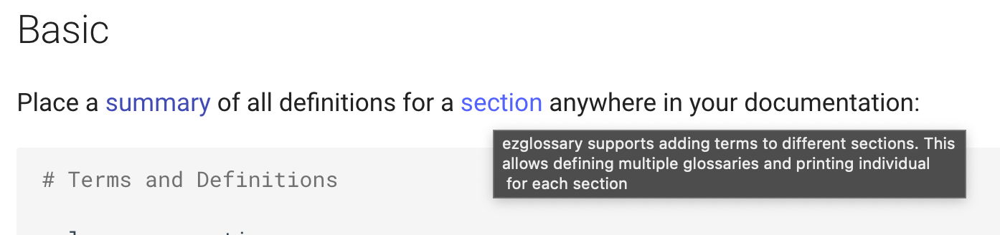

# Linking to a glossary entry

## Basic

Link to this glossary definition using the following
syntax. This will produce a link to the definition in your documentation:

``` markdown
-   See the <section:term> for details
```

!!! Example

    Link to the previously defined `glossary` term in the `term` section:

    ``` markdown
    -   See the <demo:my_term1> for definition of term 1
    -   See the <demo:my term 2> for definition of term 2
    ```

    -   See the <demo:my_term1> for definition of term 1
    -   See the <demo:my term 2> for definition of term 1

## Individual reference texts

By default the <term:term> is used as text for the link, however,
you can override the term using the `|` modifier:

!!! Example

    ``` markdown
    -   You can define multiple <term:section|glossary sections>
    ```

    -   You can define multiple <term:section|glossary sections>

!!! Note

    When using a link with individual reference texts in a table,
    you need to quote the `|`.

    ``` markdown
    | row1                              | row2 |
    |-----------------------------------|------|
    | <term:section\|glossary sections> | ...  |
    ```
    
## Using markdown links
> starting from version `1.6.0`

When setting the <configuration:markdown_links> to `true`, 
ezglossary will also search for markdown links. If it identifies that
a link points to a glossary entry, it will link it as well:

!!! Note

    When using unicode characters in term definitions, linking them
    using the `<section:term>` syntax might not work. In this case
    you have to use markdown links in order to link to those terms.

!!! Note

    In case your definition contains emojis, linking them using
    the `<section:term>` syntax will not work as well. In this case
    you have to use markdown links.

    !!! Example

        ``` markdown
        my happy term :smile:
        :   I am so happy

        -   See [](my happy term)
        ```

``` yaml
plugins:
    search
    ezglossary:
      markdown_links: true
```

!!! Example

    ``` markdown
    -   See [](configuration:tooltip) for details
    -   See [tooltips](configuration:tooltip) for details
    ```

    !!! Output

        -   See [](configuration:tooltip) for details
        -   See [tooltips](configuration:tooltip) for details


configuration:markdown_links
:   Defines wether ezglossary should also link markdown links to
    glossary entries.


## Tooltips

The <configuration:tooltip> configuration allows you to control wether
tooltips should be displayed with a preview on the definition:

``` yaml
plugins:
    search
    ezglossary:
      tooltip: [none, heading, full]
```

Options:

none
:   Tooltips are disabled

heading
:   The <term:reference> link shows the first line of the definition as a tooltip
    (link title)

full
:   The reference link shows the full definition as a tooltip.

!!! Example

    ```markdown
    plugins:
        search
        ezglossary:
          tooltip: full
    ```

    !!! Quote "Active tooltips"

        


## Configuration

configuration:tooltip
:   Configure [tooltips](#tooltips) for reference links. Default is `none`.
